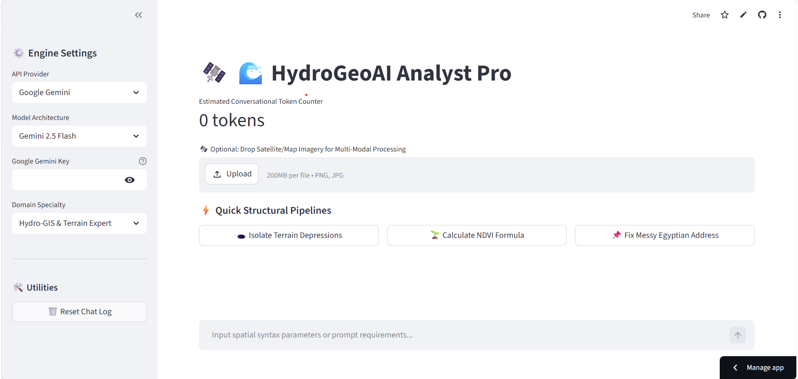

Markdown
# 🌊 HydroGeoAI Analyst Pro

An advanced, multi-provider AI-powered spatial analytics dashboard designed to bridge the gap between automated hydrological engineering workflows and remote sensing analysis. Built specifically for GIS analysts and civil engineers working on terrain processing, depression isolation, and catchment characterization.

---

## 🚀 Core Architectural Features

* **Multi-Modal Satellite Diagnostics:** Drop standard `.png` or `.jpeg` raster matrix captures directly into the interface for instant structural reasoning and land cover assessments.
* **Multi-Provider Engine Routing:** Toggle fluidly between **Google Gemini (2.5 Flash/Pro)** for multimodal processing and **Groq Cloud (Llama 3.3 70B )** for rapid, advanced spatial script logic generation.
* **Quick-Action Pipeline Presets:** One-click execution blocks for complex workflows, including ArcPy depression extraction formulas, Sentinel-2 NDVI calculations, and Egyptian national grid coordinate reference mappings.
* **Real-Time Token Footprint Tracker:** A custom metric counter that estimates conversational tokens dynamically to assist with API performance optimization.
* **Instant Markdown Session Export:** Download your entire workspace dialogue, code blocks, and analysis logs with a single click as a clean `.md` log file.

---

## 📸 Interface Preview & Demo

### Application Dashboard Layout


### Live Workflow Demonstration


---

## 🛠️ Local Environment Installation

Follow these steps to run the hydro-spatial workspace dashboard on your local machine:

### 1. Clone the Workspace Repository
```bash
git clone [https://github.com/MashaelSinger/hydrogeoai-analyst.git](https://github.com/MashaelSinger/hydrogeoai-analyst.git)
cd hydrogeoai-analyst
2. Configure Your Python Virtual Environment
Bash
# Create the environment
python -m venv .venv

# Activate the environment (Windows PowerShell)
.venv\Scripts\Activate.ps1

# Activate the environment (Mac/Linux Bash)
source .venv/bin/activate
3. Install Package Dependencies
Ensure your environment is running the latest pip manager, then install the project manifest requirements:

Bash
pip install --upgrade pip
pip install -r requirements.txt
4. Wire Up Your Environment Secrets
Create a secure local environment configuration file in the project's root folder:

Bash
cp .env.example .env
Open your newly created .env file and add your secret developer access tokens (make sure there are no spaces or quotes around the values):

Plaintext
GOOGLE_API_KEY=AIzaSyYourSecretGeminiKeyHere
GROQ_API_KEY=gsk_YourSecretGroqKeyHere
⚠️ CRITICAL SECURITY NOTE: The .env file is explicitly listed inside our .gitignore manifest. Never commit real operational API keys to public source control.

5. Launch the Streamlit Engine
Bash
streamlit run app.py
The interface will compile instantly and serve your workspace dashboard locally at http://localhost:8501.

📐 Regional Engineering Specifications
When prompting the assistant for processing code inside the Egyptian National Grid domains, the underlying system prompt is optimized to favor:

Projected Coordinate Systems: Egypt 1907 / Red Belt (EPSG:22991) for Nile Delta coverage or UTM Zone 36N (EPSG:32636).

Terrain Workflows: Depression extraction using the Minus and Con spatial analyst tools to isolate micro-catchments from raw Digital Elevation Models (DEMs).

📄 License & Assignment Submission
Developed by Mashael Singer as part of the GIS & AI specialization curriculum at the Information Technology Institute (ITI). Distributed under the MIT License.


---

